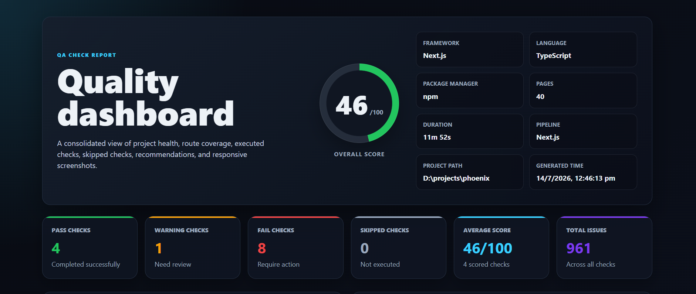
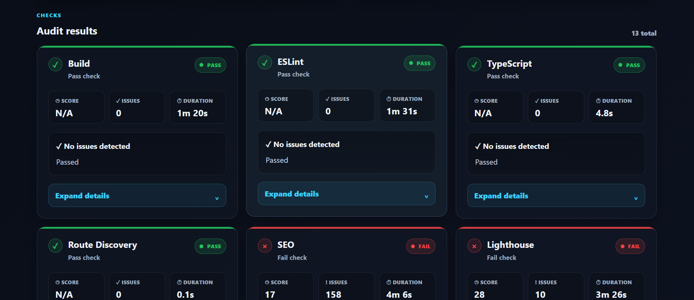
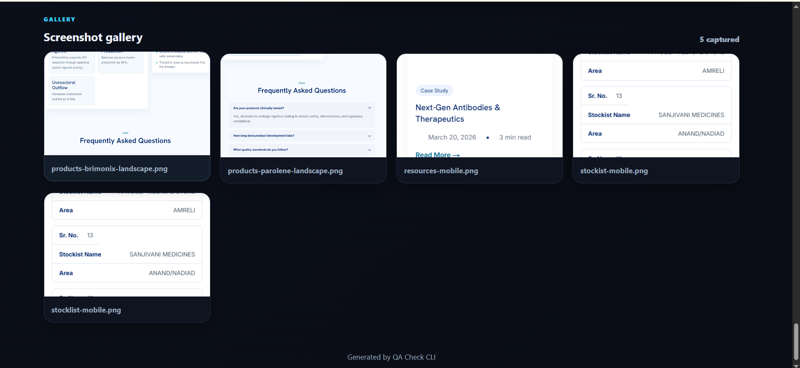

# 🚀 QA Check CLI

<p align="center">

A powerful **framework-aware Quality Assurance CLI** that automatically audits modern web projects for **code quality, SEO, accessibility, performance, responsiveness, broken links, images, console errors, network issues, and more.**

Detect the framework → Select the correct QA pipeline → Generate a beautiful report.

</p>

---

## ✨ Features

- 🔍 Automatic framework detection
- ⚡ Framework-specific QA pipelines
- 🏗 Build validation
- 📝 ESLint validation
- 📘 TypeScript validation
- 📱 Responsive design testing
- ♿ Accessibility audit (axe-core)
- 🌐 SEO audit
- 🚀 Lighthouse audit
- 🔗 Broken link detection
- 🖼 Broken image detection
- 🐞 Console error detection
- 🌍 Network request validation
- 📄 Beautiful HTML report
- 📊 JSON report
- 🎯 Overall Quality Score
- 📸 Responsive screenshots

---

# 📸 Screenshots

## Dashboard

> Replace these images with your own screenshots.



---

## Audit Results



---

## Screenshot Gallery



---

# 📦 Installation

Install globally

```bash
npm install -g qa-check-cli
```

Verify installation

```bash
qa-check --version
```

---

# 🚀 Usage

Audit current project

```bash
qa-check .
```

Audit another project

```bash
qa-check "D:\Projects\Phoenix"
```

Laravel Example

```bash
qa-check "C:\xampp\htdocs\LaravelProject"
```

---

# 📄 Generated Report

After the audit finishes

```
reports/

├── index.html
├── report.json
└── screenshots/
```

Open

```
reports/index.html
```

to view the complete interactive dashboard.

---

# 📊 Sample Output

```
QA CHECK

Framework : Next.js

Pipeline : Next.js

Pages : 40

✔ Build
✔ ESLint
✔ TypeScript
✔ Responsive
✔ Accessibility
✔ SEO
✔ Lighthouse

Overall Score

92/100
```

---

# 🌍 Supported Frameworks

### Frontend

- Next.js
- React
- Vue
- Angular
- Nuxt
- Astro
- Svelte
- SvelteKit
- Qwik
- Gatsby
- Remix
- SolidJS
- Vite

### Backend

- Laravel
- PHP
- Express
- NestJS
- Fastify
- Koa
- Hono
- Flask
- Django
- FastAPI
- Spring Boot
- ASP.NET

### CMS

- WordPress
- Drupal
- Joomla
- Magento
- Shopify
- Ghost

### Mobile

- React Native
- Flutter
- Swift
- SwiftUI
- Android
- Kotlin
- Expo

### Desktop

- Electron
- Tauri

---

# 🔍 QA Checks

## Code Quality

- Build Validation
- ESLint
- TypeScript

## UI & UX

- Responsive Design
- Accessibility
- Performance

## SEO

- Page Title
- Meta Description
- Canonical URL
- Open Graph
- Twitter Card
- Structured Data
- Duplicate Metadata

## Network

- Broken Links
- Broken Images
- Console Errors
- Failed Requests

## Lighthouse

- Performance
- Accessibility
- SEO
- Best Practices

---

# 📋 Requirements

- Node.js 20+
- Google Chrome (for Lighthouse)
- npm

Some framework-specific pipelines require their native tools.

Examples

- PHP / Composer (Laravel)
- Flutter SDK
- Android SDK
- .NET SDK
- Java (Spring Boot)

---

# 🔄 Updating

```bash
npm update -g qa-check-cli
```

---

# 🛣 Roadmap

### Current

- ✅ Framework Detection
- ✅ Framework Pipelines
- ✅ HTML Dashboard
- ✅ Lighthouse
- ✅ Accessibility
- ✅ SEO
- ✅ Performance
- ✅ Responsive Testing

### Upcoming

- 📈 Historical Reports
- 📊 Charts & Analytics
- 🔍 Interactive Search
- 🎯 Issue Filtering
- 📄 PDF Export
- 📑 Excel Export
- 🌙 Dark / Light Theme
- ☁ CI/CD Integration
- 🤖 GitHub Action

---

# 🤝 Contributing

Contributions are welcome.

1. Fork the repository
2. Create a feature branch
3. Commit your changes
4. Open a Pull Request

---

# 🐞 Report Issues

Found a bug?

Please create a GitHub Issue with:

- Framework
- OS
- Node Version
- Error Log
- Generated Report

---

# 📄 License

MIT License

---

# 👨‍💻 Author

**Zeel Patel**

QA Check CLI is an open-source project focused on making Quality Assurance faster, smarter, and framework-aware.